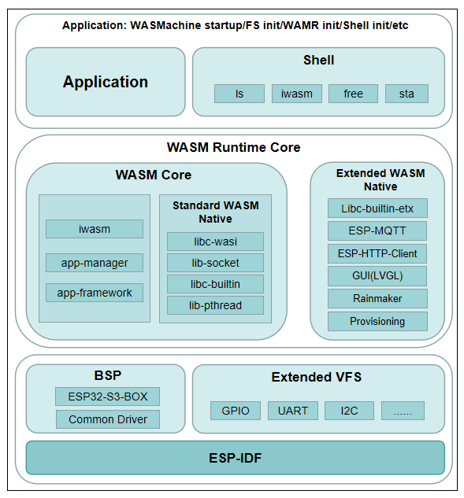

# Espressif IoT WebAssembly Virtual-Machine Development Framework(Preview)

* [中文版](./README_CN.md)

## 1. Introduction

ESP-WASMachine is a WebAssembly VM (virtual-machine) development framework for IoT (Internet of Things) applications. For the corresponding WebAssembly application development framework, please refer to [README](https://github.com/espressif/esp-wdf/README.md). The main components and architecture of software are as follows:

<div align="center"></div>

### 1.1 Directory

The main directory structure of ESP-WASMachine is as follows:

```
esp-wasmachine/
    ├── components
        ├──boards                       Board support package
            ├──common                   General purpose drivers of development board
            ├──esp-box                  Specific drivers of ESP-BOX development board
        ├──data_sequence                Data sequences used for parameter transfer between VM and APP
        ├──extended_wasm_vfs            Hardware drivers based on virtual file system
            ├──src
                ├──wm_ext_vfs.c         Initialization of hardware drivers, depends on extended_vfs of esp-iot-solution
                ├── ...
        ├──extended_wasm_native         WebAssembly Native API
            ├──src
                ├──wm_ext_wasm_native_mqtt.c    WebAssembly MQTT Native API
                ├──wm_ext_wasm_native.c     WebAssembly Native API initialization
                ├── ...
        ├──shell                        Shell command line interface
            ├──src
                ├──shell_iwasm.c        Command 'iwasm'
                ├──shell_init.c         Initialization of shell command line interface
                ├── ...
        ├──wamr                         wasm-micro-runtime (WAMR)
        ├──wasmachine                   WAMR platform adapter and extension
            ├──src
                ├──wm_wamr_app_mgr.c    App manager adapter and initialization
                ├──wm_wamr.c            WAMR heap adapter
    ├──main
        ├──fs_image                     File-system root directory used by default
            ├──hello_world.wasm         WebAssembly application binary
        ├──wm_main.c                    System initialization and bring-up
```

## 2. Install Development Environment

ESP-WASMachine can be considered as an application project based on ESP-IDF in the implementation principle, so the development environment of ESP-IDF needs to be installed. For the relevant process, please refer to ESP-IDF [documents](https://docs.espressif.com/projects/esp-idf/en/v4.4.3/esp32s3/get-started/index.html#get-started).

The supported version of ESP-IDF is as follows:

- [v4.4.3](https://github.com/espressif/esp-idf/tree/v4.4.3)

The supported development boards are as follows:

- [ESP32-S3-BOX](https://github.com/espressif/esp-box/blob/v0.3.0/docs/hardware_overview/esp32_s3_box/hardware_overview_for_box_cn.md)

- [ESP32-S3-BOX-Lite](https://github.com/espressif/esp-box/blob/v0.3.0/docs/hardware_overview/esp32_s3_box_lite/hardware_overview_for_lite_cn.md)

In addition, it is also necessary to download the third-party software to ESP-WASMachine. The source code of the third-party software in the corresponding version will be automatically downloaded and patched when it is compiled for the first time. The relevant log information is as follows:

```sh
clone 'https://github.com/joltwallet/esp_littlefs.git' branch 'v1.4.1' into 'components/esp_littlefs'
patch 'components/esp_littlefs'
clone 'https://github.com/lvgl/lvgl.git' branch 'v8.1.0' into 'components/LVGL'
patch 'components/lvgl'
clone 'https://github.com/espressif/esp-rainmaker.git' branch 'master' into 'components/esp-rainmaker'
checkout 'components/esp-rainmaker' to commit id '00bcf4c0'
clone 'https://github.com/bytecodealliance/wasm-micro-runtime.git' branch 'fast-jit-06-29-2022' into 'components/wamr/wasm-micro-runtime'
patch 'components/wamr/wasm-micro-runtime'
patch esp-idf
```

To ensure safety of your data (for example, you want to modify third-party software source code according to requirements), the compilation system only clones and patches these third-party software. If compiling problems occur because of software updating or other reasons, you can delete these third-party software manually and retry.

To remotely manage WebAssembly applications, you also need to compile and generate `host_tool`. However, `host_tool` can only be compiled and used in Linux. The relevant compilation process is as follows:

```
cd components/wamr/wasm-micro-runtime/test-tools/host-tool
mkdir build
cd build
cmake ..
make
```

Run the command `ls` to see the generated program `host_tool` in the current directory:

```sh
ubuntu > ls
CMakeCache.txt CMakeFiles cmake_install.cmake host_tool Makefile
```

## 3. Tool Introduction

### 3.1 Command Line Tool

ESP-WASMachine integrates command line tools to facilitate development and debugging. The supported commands are as follows:

#### 3.1.1 iwasm

Load the WebAssembly application file from the file-system and run it. The command format is following:

```
iwasm <file> <args> [Configuration parameters]

    file: WebAssembly application file name with full path
    args: WebAssembly application runtime parameters
```

The relevant configuration parameters are described as follows:

```
    -s/--stack_size: size of the WebAssembly application stack, in bytes
    -h/--heap_size:  size of the WebAssembly application heap, in bytes
    -e/--env:        environment variable of the WebAssembly WASI application. multiple variables are separated by the symbol ",", for example:
                        single variable: --env=\"key1=value1\"
                        multiple variables: --env=\"key1=value1\",\"key2=value2\",...
    -d/--dir:        directory that WebAssembly WASI allows applications to access, multiple directories are separated by the symbol ",", for example:
                        single directory: --dir=<dir1>
                        multiple directories: --dir=<dir1>,<dir2>,...
    -a/--addr-pool:  indicates the peer network address that the WebAssembly WASI allows the application to access. Multiple addresses are separated by a comma (,), for example:
                        single address: --addr-pool=1.2.3.4/15
                        multiple address: -- addr - pool = 2/15,2.3. 4.5/16,...
```

The configuration parameters `-e/--env`, `-d/--dir` and `-a/--addr-pool` can be used only when libc WASI is enabled, and it can be enabled by the configuration WAMR_ENABLE_LIBC_WASI. The reference command is as follows:

Non-libc WASI mode:

```sh
iwasm wasm/demo.wasm -s 262144 -h 262144
```

Libc WASI Mode:

```sh
iwasm wasm/demo.wasm -s 262144 -h 262144 -e \"key1=value1\" -a 1.2.3.4/15
```

#### 3.1.2 ls

Display the files in the target directory by running the following command:

```
ls <file_or_directory>

    file_or_directory: directory name with full path
```

#### 3.1.3 free

Display memory heap information, including total, used, and remaining heap size. When PSRAM is enabled, it also can show DRAM and PSRAM memory heap information respectively. The reference command is as follows:

```
free
```

#### 3.1.4 sta

Configure SSID and password of the target AP for Wi-Fi station, and start connecting to the target AP. The reference command is as follows:

```
sta -s <SSID> -p <password>
```

#### 3.1.5 install

Install WebAssembly application in file-system:

```
install <file> [Configuration parameters]

    file: WebAssembly application file name with full path
```

The relevant configuration parameters are described as follows:

```
	-i: name of the application
	--heap: heap size of app, in bytes
	--type: type of app
	--timer: max timers number app can use
	--watchdog: watchdog interval in ms
```

#### 3.1.6 uninstall

Uninstall WebAssembly application:

```
uninstall [Configuration parameters]
```

The relevant configuration parameters are described as follows:

```
	-u: name of the application
	--type: type of app
```

### 3.2 Application Management Tool

The remote application management tool [host_tool](https://github.com/bytecodealliance/wasm-micro-runtime/tree/main/test-tools/host-tool) of WebAssembly is a built-in tool of wasm-micro-runtime (WAMR). It allows you to remotely install/uninstall WebAssembly applications on devices by communicating with hardware devices through TCP/UART (currently TCP only). The reference command is as follows:

```
./host_tool -i/-u/-q [configuration parameters]

    -i: installs an application
    -u: uninstalls an application
    -q: Obtains the application information
```

The relevant configuration parameters are described as follows:

```
    -f: WebAssembly application file name with full path
    -s: IP address of the hardware device
    -p: TCP port number used by the app manager which is running on the hardware device
```

You can check other command formats and parameters by running `./host_tool`.

## 4. Compile and Run Project

Configure the development environment in the ESP-IDF root directory by running the following commands:

```
. ./export.sh
```

Then switch to the ESP-WASMachine directory and run the commands provided by ESP-IDF to configure/compile/download/debug. The related process is as follows:

### 4.1 Configure the system

```
idf.py -DBOARD=esp-box menuconfig
```

The parameter `-DBOARD=esp-box` indicates using the components/boards/esp-box board support packages. This parameter is optional. If you only run the command `idf.py menuconfig`, the build system will use esp-box by default because `BOARD` is not specified.

Enable App Manager to enable remote management of WebAssembly application as follows:

```
WASMachine Configuration --->
    Generic --->
        [*] Enable WAMR APP Management
```

### 4.2 Burn File-System

The littleFS file system will be mounted by default, so littleFS image should be burned in advance. Otherwise, the system will fail to start. The reference command is as follows:

```
idf.py storage-flash
```

The burning image is generated by `main/fs_image`, so it will contain the subdirectories and files under the `main/fs_image` directory. You can put the required files into the directory and burn them.

- ** Note ** : After the file system image is burned again, you will lose the data stored in the previous file system in flash.

### 4.3 Compile and Download

```
idf.py build flash
```

After downloading all firmware according to the above steps, you need to run the command `idf.py monitor` to start the serial port tool and show the startup log information. The system enters the command line menu if the following log information appears:

```
Type 'help' to get the list of commands.
Use UP/DOWN arrows to navigate through command history.
Press TAB when typing command name to auto-complete.
WASMachine>
```

For more compiling and debugging commands, please refer to ESP-IDF [documents](https://docs.espressif.com/projects/esp-idf/en/v4.4.3/esp32s3/api-guides/build-system.html#idf-py).

### 4.4 Run WebAssembly Application

By running the command `ls wasm`, you can see the files that the littleFS image stored in the `wasm` directory of the WebAssembly application `hello_world.wasm`. Input the command `iwasm wasm/hello_world.wasm` to run the WebAssembly application. If the firmware is flashed successfully, the following log appears:

```
Hello World!
```

You can burn your own WebAssembly applications to the file system as described in [Related Instructions](#4.2-burn-file-system).

### 4.5 Install/Uninstall WebAssembly Application Remotely

The TCP port number is defined by the configuration WASMACHINE_TCP_SERVER, and the default value is 8080. You can change the TCP port number in the following menu:

```
WASMachine Configuration --->
    Generic --->
        [*] Enable WAMR APP Management
        [*] Enable TCP server
        (8080) TCP Port
```

Run the command `host_tool` to install/uninstall/view the WebAssembly application. For details, please refer to [Related Instructions](#3.2-application-management-tool).

By default, the device can only install three applications at most. If you want to install more applications, please modify the macro definition in the source `components/wamr/wasm-micro-runtime/core/config.h`. The macro is shown as follows:

```c
/* Max app number of all modules */
#define MAX_APP_INSTALLATIONS 3
```

#### 4.5.1 Connect to AP

Input the following command (replace `myssid` and `mypassword` with your SSID and password). To remotely install/uninstall WebAssembly applications, you should ensure that the PC and hardware devices are in the same AP network:

```
WASMachine> sta -s myssid -p mypassword
```

If the AP is connected and the IP address is obtained, the following log information appears. Please be noted that the specific value of the IP address depends on the actual situation.

```
I (158337) esp_netif_handlers: STA IP: 172.168.30.182, mask: 255.255.255.0, GW: 172.168.30
```

#### 4.5.2 Install

Run the following command to install the local `hello_world.wasm` on the hardware device remotely. `app0` is the application name.

```
cd esp-wasmachine
./components/wamr/wasm-micro-runtime/test-tools/host-tool/build/host_tool \
    -i app0 \
    -f main/fs_image/wasm/hello_world.wasm \
    -S 172.168.30.182 \
    -P 8080
```

The installation is successful if the following information appears:

```
response status 65
```

#### 4.5.2 View

Run the following command to obtain the information about `app0`:

```
./components/wamr/wasm-micro-runtime/test-tools/host-tool/build/host_tool \
    -q app0 \
    -S 172.168.30.182 \
    -P 8080
```

The above command is executed successfully if the following log appears. You can obtain the information of `app0` from this log.

```
response status 69
{
        "num": 1,
        "applet1": "app0",
        "heap1": 8192
}
```

#### 4.5.3 Uninstall

Run the following command to uninstall the installed `app0`:

```
./components/wamr/wasm-micro-runtime/test-tools/host-tool/build/host_tool \
    -u app0 \
    The -s 172.168.30.182 \
    -P 8080
```

You managed to uninstall `app0` if the following information appears:

```
response status 66
```

## 5. Future Work

ESP-WASMachine is an attempt of WebAssembly technology on ESP32 series chips. There are still some unresolved problems worth exploring. We will address these problems in the coming days and add more rich and easy-to-use features. With this base release, our goal is to make it easier for you to develop WebAssembly virtual machine applications, add new extensions, and deploy applications.

If you have ideas or requirements that improve this SDK well, or if solving such problems makes you excited, we would like to talk to you for collaboration.
